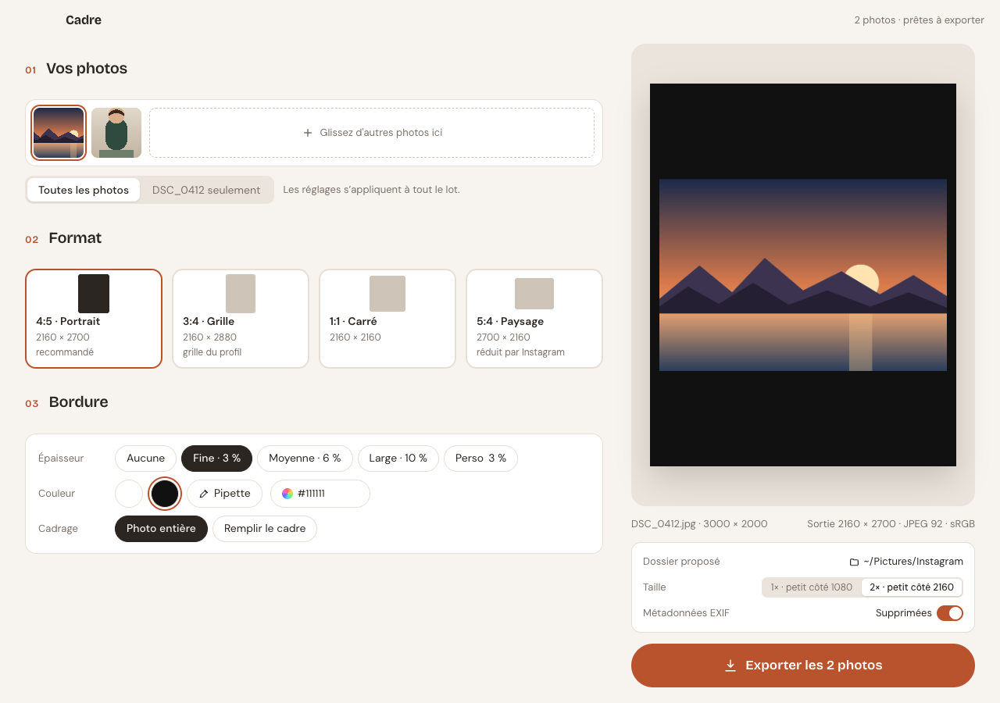
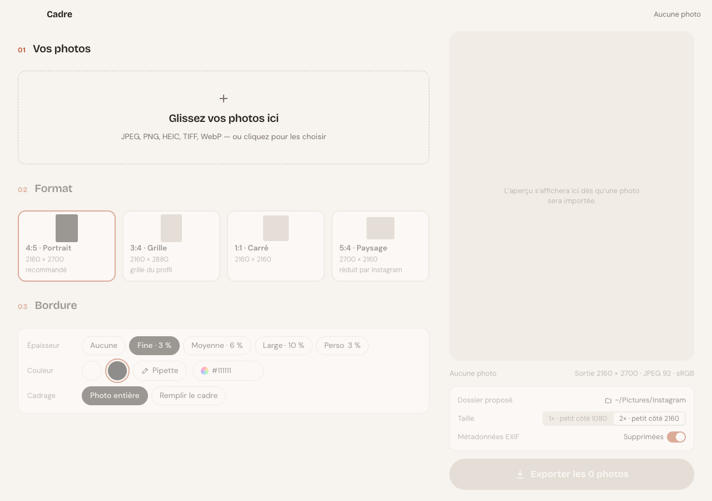

# Cadre

Application macOS pour préparer des photos avant publication sur Instagram : choix du format, bordure de couleur, export JPEG sRGB conforme aux recommandations Instagram. Un lot de photos brutes devient une série homogène, prête à publier, en moins d'une minute.



## Ce que fait l'application

- **Import** par glisser-déposer ou sélecteur de fichiers : JPEG, PNG, HEIC, TIFF, WebP. L'orientation EXIF est appliquée, les HEIC d'iPhone passent sans étape manuelle.
- **Format** parmi 4:5 (recommandé), 3:4, 1:1 et 5:4. Règle unique : le petit côté fait toujours 1080 px (ou 2160 px en 2×).
- **Bordure** en pourcentage du petit côté, avec préréglages (aucune, fine, moyenne, large) ou curseur libre. Couleur blanc, noir, pipette dans l'aperçu, code hex ou sélecteur système.
- **Cadrage** photo entière (la photo est contenue dans le cadre) ou remplir le cadre (recadrage centré).
- **Réglages par photo** : par défaut tout le lot partage les mêmes réglages ; une bascule permet d'ajuster une photo à part, avec retour aux réglages du lot en un clic.
- **Aperçu fidèle** : le canvas utilise exactement la même géométrie que le rendu final.
- **Export** JPEG qualité 92, sous-échantillonnage 4:4:4, profil sRGB, fichier garanti sous 8 Mo. Métadonnées EXIF supprimées par défaut ; si conservées, seule une liste blanche est réécrite et le GPS disparaît toujours.
- **Mémoire** du dossier d'export et des derniers réglages entre deux lancements.

## Avant / après

Photo d'origine, puis export 4:5 « photo entière » avec bordure blanche 6 %, puis export 4:5 « remplir le cadre » avec bordure de la couleur du ciel.


## Au démarrage



## Raccourcis clavier

| Touche | Action |
|---|---|
| ← / → | Photo précédente / suivante |
| Retour arrière / Suppr | Retirer la photo sélectionnée du lot |
| Échap | Quitter la pipette |

## Documentation

- [PRD](docs/PRD.md) — problème, objectifs, exigences, critères d'acceptation
- [Fonctionnalités](docs/features/) — une fiche par fonctionnalité (import, formats, bordure, réglages par photo, export)
- [Architecture](docs/architecture.md) — processus Electron, contrat IPC, pipeline image, packaging

## Développement

```bash
npm install
npm run dev        # lance l'app avec rechargement à chaud
npm test           # tests vitest (géométrie, rendu sharp, export)
npm run typecheck  # main + preload + renderer
npm run lint
```

Outils de développement, actifs uniquement avec `npm run dev` :

```bash
# Importe des photos au démarrage
CADRE_DEV_IMPORT=a.jpg,b.heic npm run dev
# Enregistre une capture de la fenêtre puis quitte (délai en ms, 4000 par défaut)
CADRE_DEV_SHOT=capture.png CADRE_DEV_SHOT_DELAY=5000 npm run dev
```

## Packaging

```bash
npm run build:mac  # produit dist/Cadre-<version>.dmg (arm64, non signé)
```

Première ouverture d'une build non signée : clic droit sur l'app → Ouvrir.

## Publier une version

Le numéro de version vit dans `package.json` ; le tag git n'en est que le reflet.
`npm version` fait les deux d'un coup — il met à jour `package.json` et
`package-lock.json`, commite, puis pose le tag correspondant :

```bash
npm version patch   # 0.1.0 -> 0.1.1   (patch | minor | major, ou un numéro exact)
git push --follow-tags
```

Il reste à créer la release GitHub sur ce tag :

```bash
gh release create "v$(node -p "require('./package.json').version")" --generate-notes
```

Sa publication déclenche le workflow [Build macOS](.github/workflows/release-macos.yml),
qui construit le dmg et le zip arm64 puis les attache à la release. Le workflow
refuse de construire si le tag et `package.json` divergent, donc passer par
`npm version` n'est pas une politesse : c'est ce qui garde les deux d'accord.

Pour vérifier un build sans rien publier, lancer le workflow à la main
(`gh workflow run release-macos.yml`) : les fichiers sont déposés en artefacts du run.

## Stack

Electron 39 · electron-vite · React 19 · TypeScript · zustand · sharp (libvips) · vitest

Les photos des captures sont des images de synthèse générées pour la démonstration.
